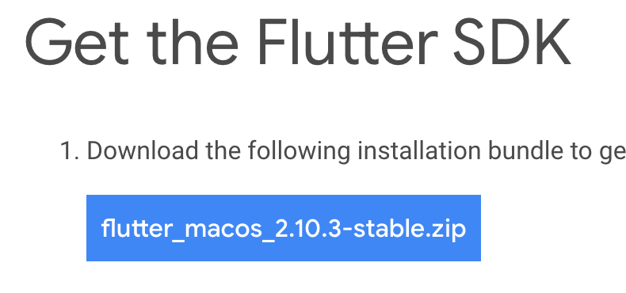
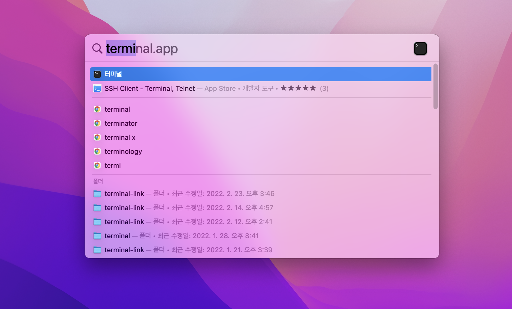

# Method 1 : Install Flutter via zip file

## 1. Download Flutter SDK
Go to [https://docs.flutter.dev/get-started/install/macos#get-sdk](https://docs.flutter.dev/get-started/install/macos#get-sdk)  and download Flutter SDK file.


## 2. Unzip File
Open terminal and type commands below.


```bash
mkdir ~/development
cd ~/development
unzip ~/Downloads/flutter_macos_2.10.3-stable.zip
```

## 3. Set Environment Variable
On that terminal type below command to set environment variable for flutter.
```bash
export PATH=“$PATH:`pwd`/flutter/bin"
```

## 4. Run “flutter doctor”
Run "flutter doctor" on that terminal to check that flutter is properly installed.
```bash
flutter doctor
```

# Method 2 : Install Flutter via homebrew

## 1. Run “homebrew install flutter”

```bash
homebrew install flutter
```

## 2. Run “flutter doctor”

```bash
flutter doctor
```